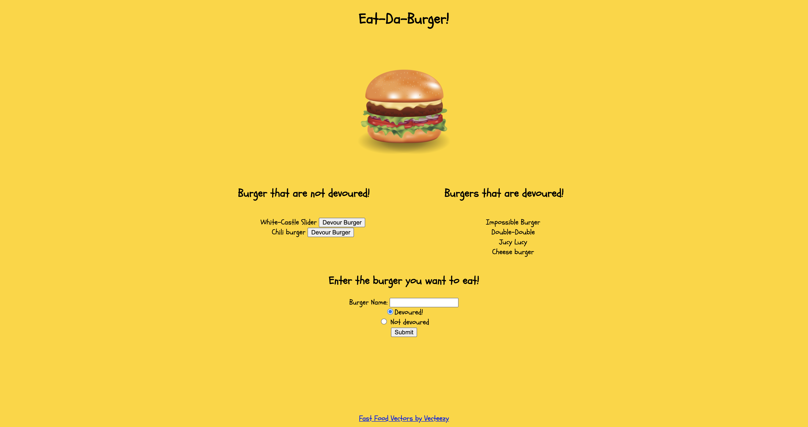

# 💡 Project Title: burger_express_logger

## 🕹 Demo:

Video of demo: [burger_express_logger_DEMO](https://drive.google.com/file/d/1pGm_qYuKIscrA3aRoZfXsRlJ4pXH1QIE/view) 

 
## 👤 Author: Joseph Jepson 

  ## 📜 Table of Contents: 

  * [Description](#Description) 

  * [Installation](#Installation) 

  * [Usage](#Usage) 

  * [Contributors](#Contributors) 

  * [Testing](#Testing)

  * [Contact](#Contact) 

  * [License](#License) 

  ## Description: 
 Node.js Express app, using MySQL as a database with Handlebars to serve the HTML page. When a user visits this application, they can enter a burger that they would like to eat! Then they can click the 'devour' button to eat the burger they submitted!

[View Deployment](https://floating-plateau-77667.herokuapp.com/)

## Installation: 
 Clone the repo, and run 'npm init', 'npm install'. Copy the 'schema.sql' text into a mysql workbench file, execute the script. Copy the seeds to insert data into the table.  

## Usage: 
 Run 'node server.js' to start application. In order to use this application the user will need to use the schema and seeds to get starting data into the database. 

## Credits: 
* 👤 [Andrew Moses](https://github.com/andrewmosesdrive) - worked together to help complete this assignment. 

## Testing: 

  ## Contact: 
 
  * 💌  Email: joey@joeyjepson.com 
 
  * 👤  GitHub Username: [alligatormonday](https://github.com/alligatormonday) 

  ## License: 
 
  
    MIT License

Copyright (c) 2020 Joseph Jepson

Permission is hereby granted, free of charge, to any person obtaining a copy
of this software and associated documentation files (the "Software"), to deal
in the Software without restriction, including without limitation the rights
to use, copy, modify, merge, publish, distribute, sublicense, and/or sell
copies of the Software, and to permit persons to whom the Software is
furnished to do so, subject to the following conditions:

The above copyright notice and this permission notice shall be included in all
copies or substantial portions of the Software.

THE SOFTWARE IS PROVIDED "AS IS", WITHOUT WARRANTY OF ANY KIND, EXPRESS OR
IMPLIED, INCLUDING BUT NOT LIMITED TO THE WARRANTIES OF MERCHANTABILITY,
FITNESS FOR A PARTICULAR PURPOSE AND NONINFRINGEMENT. IN NO EVENT SHALL THE
AUTHORS OR COPYRIGHT HOLDERS BE LIABLE FOR ANY CLAIM, DAMAGES OR OTHER
LIABILITY, WHETHER IN AN ACTION OF CONTRACT, TORT OR OTHERWISE, ARISING FROM,
OUT OF OR IN CONNECTION WITH THE SOFTWARE OR THE USE OR OTHER DEALINGS IN THE
SOFTWARE.